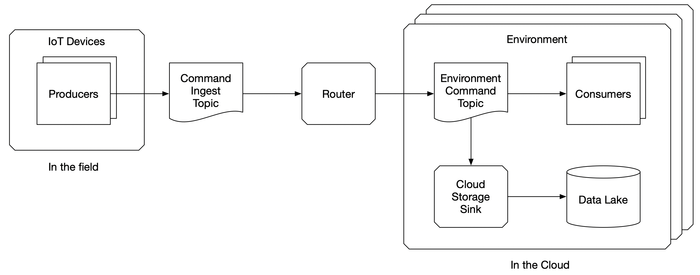
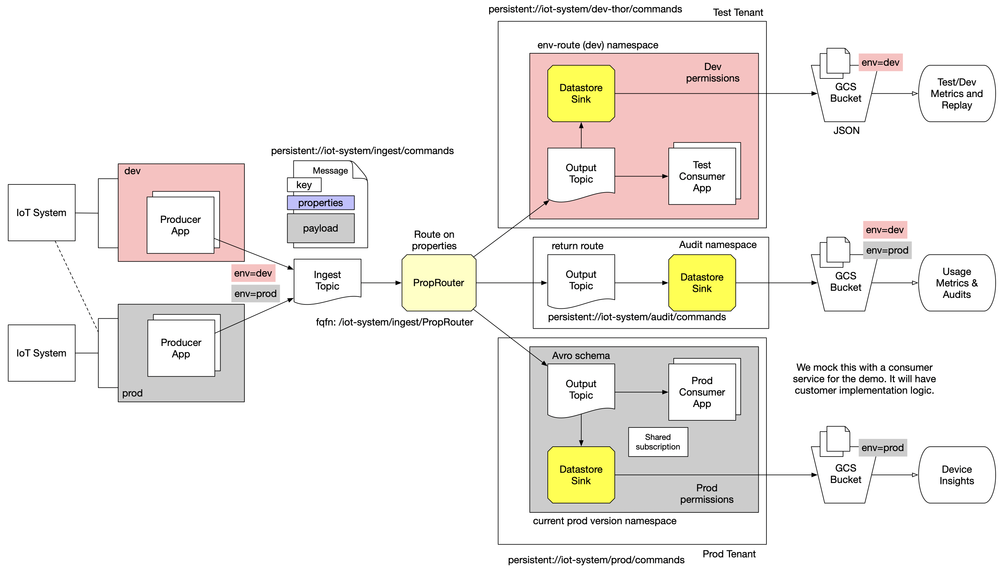
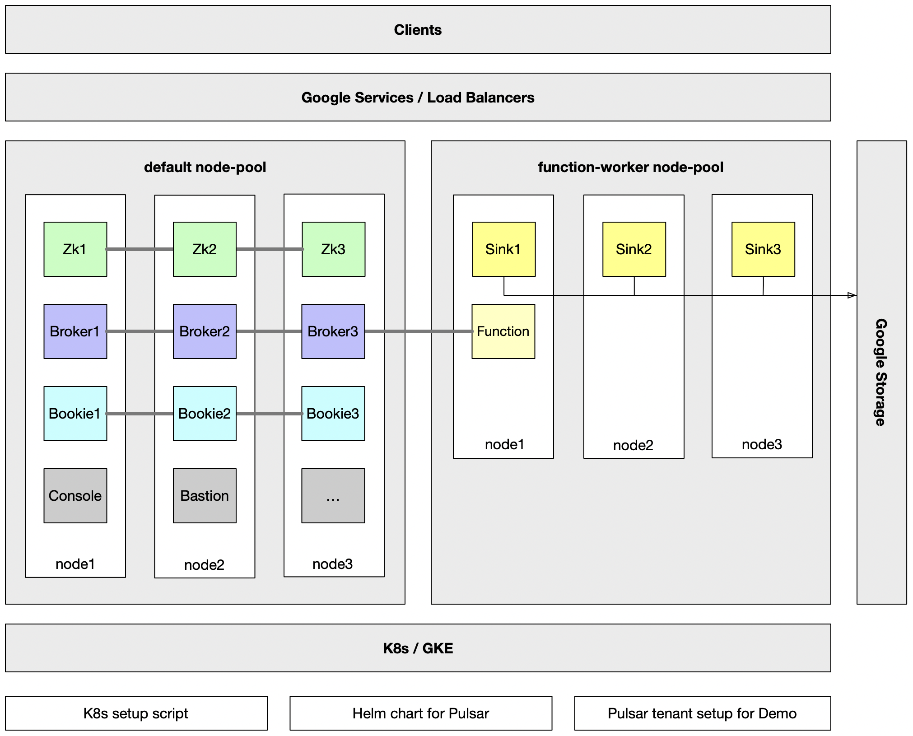

# IoT Dev/Test in Production -  Solution And POC Demo
IoT Infrastructure for Dev/Test/Prod

Thor Sigurjonsson  - Solutions Architect


## High Level Goals
- Support IoT Device Development in the field (WFH scenarios) with hardware devices
- Allow for switching of IoT devices to dev/test and back to normal prod operation
- Allow for real-time backend services development by developers alongside production services
  - Get dev/test data from their IoT devices to their dev/test environment
  - Dev/Test devices use Dev/Test backend services, not Prod services
- Avoid building separate Dev/Test/Stage/Prod clusters and infrastructure
  - Use same cloud-scale environment for dev/test and prod
  - Canary deploys in same cloud-scale infrastructure




# Use Case Recap - discovery session

- IoT Producers have two main data path needs:
  - Ingestion and transfer of messages to Data Lake in Google Cloud Storage
  - Real-time consuming services for backend logic in IoT System


- IoT Devices are production systems (in customer premises) by default but can be:
  - Switched to development or test mode by local hardware config change
  - Returned back to production mode for normal behavior after dev/test work session
  - Operated out in the field by developers and testers (WFH scenarios)


- Backend IoT Services are Real-time Consumers and run in a production by default but have:
  - Development and Test versions of backend services for test/dev IoT Producers


- Do not mix dev/test data in Data Lake with prod data but audit ALL data separately (separate data)


# Demo scope and focus 

- We mock the IoT Systems as simple Pulsar producers
  - Real system authenticates developers and allows them to override environment header for dev/test environments and their App version based on device config
  - IoT Ingestion layer translates the device header to a Pulsar message properties
- We mock the IoT Backend Systems and their logic as simple Pulsar consumers
- We demonstrate routing pattern central to the solution architecture

- We demonstrate data flows to GCS Data Lake with Pulsar Connectors (with some sane defaults)
- We demonstrate deployment infrastructure (3 node minimal setup) that can be scaled up
- We ignore some specific details (authn/z, permissions on namespaces, etc), to be added later
- We simplify messages from IoT devices to just include device identifier, payload and timestamp 
- Pulsar geo-replication is ignored here but sould be part of full cloud-scale deploy

# Pulsar | Luna - key capabilities we leverage

- Pulsar is multi-tenant and has namespaces within tenants
- Pulsar Functions allow us to solve for common messaging needs without separate infrastructure
- Connectivity to storage (Pulsar IO) allows for integration with Data Lake (GCS)
- Deployment on K8s and GKE allows for customer operated solution
  - Can be solved in managed Astra solution also
  - We leverage the Helm Chart for deploying Luna on K8s
- Cloud-scale Pulsar deployment, autoscaling on K8s node pools, geo-replication, etc.


# Architecture Solution


## High Level points about the solution
- We separate dev/test & prod data flows using a Pulsar Function
  - Routing occurs on message properties for origin environment (dev/test/.../prod)
- Data Lake and Consumer Paths follow separate prod/non-prod paths
  - Data Lake separates dev/test/prod data by topic paths (tenant/namespaces/topics)
- We preserve an separate audit data flow and send it to GCS
- We allow dev/test IoT devices to set message properties that allow
- Developers can review data in GCS when it has traversed through the Pulsar data paths
  - Debugging and troubleshooting possible on data at rest by default configuration

## Infrastructure Deployment
- We run a 3 node cluster in GKE
- We have separate default-worker pool and function-worker pool to allow for more dynamic scaling of function/sink workloads
- Setup is done using a GKE setup script, Helm Chart and a Pulsar provisioning script (for tenant, function, sink setups).




## Considerations about production access controls
- Ingestion access controls need to be enforced at the boundary
  - Ingestion service or API Gateway layer needs to enforce who can set headers that turn into message properties
    - In this POC, we just show the routing pattern. 
  - Permissions need to be controlled for Pulsar namespace in the tenant to separate production from non-prod 
- Separation of production namespace(s) can be done by tenant separation, not done in this POC/demo


## Demo

### Setup Scripts

Setup scripts are in the `scripts/` folder

### Producers and Consumers
We have created a version 1 consumer and producer. These are only implementing the `NOOP` command presently (to simulate)
code in production. 

We have then implemented a version 2 consumer and producer. These have begun implementation of `PING` command for the IoT
system, and represent what developers would be doing in the field and developing in the cloud against their device in a 
dev/test environment.

These are only useful for purposes of the demo, and for gleaning basics about how consumers/producers and messaging
works in Pulsar.

###  Pulsar Function

For our POC purposes, the properties router function looks at an `env` property and publishes the message to a hardcoded 
environment topic. In the real-world, we would be looking for which dev/test environment to route to, based on the originating 
IoT device and the developer's backend test/dev environment. In this POC demo, we just have one dev environment.

```
    public DeviceMessaage process(DeviceMessaage input, Context context) {
        //String value = client.get(key);
        Map<String, String> props = context.getCurrentRecord().getProperties();
        Set<String> keys = props.keySet();
        if (keys.contains("env") ){
            String envStr = props.get("env");
            context.getLogger().info("  Message has env property: " + new String(props.get("env")));
            //context.publish(context.getOutputTopic() + "-" + envStr, input);
            String prodTopic = "persistent://iot-system/prod/commands";
            String devTopic  = "persistent://iot-system/dev/commands";
            if (envStr.equals("prod")) {
                context.publish(prodTopic, input);
            } else {
                context.publish(devTopic, input);
            }
        } else {
            context.getLogger().info("  Message does not have env property.");
        }
        return input;
    }

```
The key piece of information here, is that the context has a `.getProperties();` method which can be used to pull out the 
environment property we

# Conclusion

This solution is designed around the ability to route messages in Pulsar, baesd on message properties and using Pulsar's multi-tenant
and namespaces.

This POC shows the feasibility of routing messages from different IoT Devices (producers) to different namespaces or tenants in Pulsar, thus
allowing for separation of dev/test/stage/prod workloads in common production cluster environment. 

We also show how to configure sinks to Cloud Storage (Data Lake) and how data can be separated for dev/test and prod environments.

Key pieces to make this work in production are access controls and input validation on the ingestion layer and on controls for allowing
development in dev/test namespaces or tenants. 

Pulsar enables powerful capabilities in the messaging layer, including message routing, replication and connectivity to data systems. 

